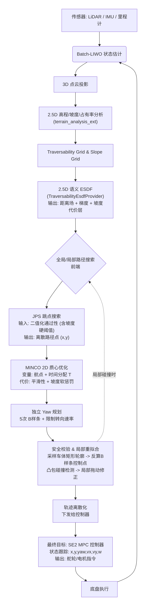

# 从 2.5D 语义 ESDF 到稳定比赛版与长期最终版导航主链

更新时间：2026-07-03

本文档只保留两条主线：

1. `V1 稳定比赛版`
   `2.5D 语义地图 + 2D 栅格导航主链 + RC-ESDF + A* / JPS + MINCO + 独立 Yaw+ 轮廓安全校验 + 局部重拟合 + SE2 MPC`
2. `V2 长期最终版`
   `3D ESDF + 2D / 2.5D 地面导航主链 + JPS + MINCO + 独立 Yaw + 轮廓安全校验 + 局部重拟合 + SE2 MPC`

当前优化工作优先服务于 `V1`。`V2` 是在 `V1` 稳定后再推进的长期目标。

## 0. 目标流程图

下面两张图对应 `V1` 的目标工程形态，核心思想与 `docs/中科大哨兵2025技术报告.pdf` 一致，但这里进一步明确：

1. 2.5D 语义建图仍然服务 `2D` 地面导航主拓扑
2. RC-ESDF 是局部滚动的语义距离场，而不是把系统升级成真正 3D 导航
3. 轨迹侧的终局不再是“B 样条平滑 + MPPI”本身，而是 `A* / JPS -> MINCO -> 独立 Yaw -> 轮廓安全校验 -> 局部重拟合 -> SE2 MPC`

简版主流程图：



分层版流程图：


这两张图表达的核心结论是：

1. 地面机器人总体导航仍然是 `2D` 栅格主链。
2. `2.5D` 前端负责高程、坡度、占有率和地形语义判断。
3. signed `RC-ESDF` 负责 clearance、gradient 和局部本体安全查询支撑。
4. `A* / JPS` 负责主搜索。
5. `MINCO + 独立 Yaw + 轮廓安全校验 + 局部重拟合` 负责把离散路径变成可执行轨迹。
6. 终局控制目标是 `SE2 MPC`。

## 1. 先说结论

对当前仓库，最合理的路线不是一步跳到“所有模块同时重写”，而是分成两个清晰层次：

1. 近期比赛优化目标：
   `LBFGS-RC-ESDF + MPPI`
2. `V1` 最终比赛版目标：
   `RC-ESDF + A* / JPS + MINCO + 独立 Yaw + 轮廓安全校验 + 局部重拟合 + SE2 MPC`

原因很明确：

1. 当前仓库已经有 `TraversabilityEsdfProvider + Nav2BSplineSmoother + MPPI` 的稳定过渡主链。
2. 先把当前 signed Traversability ESDF 演进为更强的 `RC-ESDF-lite`，可以最快获得窄门、贴边、高速转角收益。
3. 直接同时替换搜索器、轨迹优化器和执行器，会让比赛期变量过多，调试成本过高。

一句话概括：

`近期先做 LBFGS-RC-ESDF + MPPI，最终收敛到 RC-ESDF + A* / JPS + MINCO + 独立 Yaw + 局部修补 + SE2 MPC。`

## 2. V1 稳定比赛版

### 2.1 V1 的最终目标链

`Batch-LIWO / 里程计 -> 3D 点云投影 -> 2.5D Traversability + Slope -> 2D 语义 RC-ESDF -> A* / JPS 搜索 -> MINCO 优化 2D 质心位置 + 时间 -> 独立 Yaw 规划（5次 B-spline，限制转向速率） -> 采样车体轮廓并反算 B-spline 控制点做凸包安全校验 -> 若碰撞则仅局部拖动控制点重拟合 -> 输出可执行参考轨迹 -> 近端执行器（过渡期 MPPI，最终 SE2 MPC） -> chassis`

这条链是 `V1` 的比赛可用版本最终目标。

### 2.2 V1 中各层的职责

#### 状态估计层

1. 维持 `point_lio / lidar_odometry` 的稳定输出。
2. 保证时间戳和 TF 链稳定。
3. 为局部滚动 RC-ESDF、搜索器与控制器提供一致的姿态参考。

#### 2.5D 地形语义层

建议每个 `(x, y)` 栅格显式维护：

1. `z_min`
2. `z_max`
3. `height_diff`
4. `occupancy_ratio`
5. `ground_confidence`
6. `slope`
7. `slope_direction`
8. `roughness`
9. `dynamic_obstacle_confidence`
10. `traversable / occupied / unknown`

这层的任务不是“能不能走”的唯一判断，而是把地形语义转换成可规划、可控速、可解释的代价。

#### 2D 语义 RC-ESDF 层

`V1` 中的 ESDF 层应从当前 `TraversabilityEsdfProvider` 逐步演进为：

`RC-ESDF-lite`

这里的 `RC` 指的是：

1. 局部滚动窗口
2. 更强调围绕机器人当前位置的高频查询
3. 优先服务轨迹优化、轮廓校验与控制器，而不是做全局 3D 拓扑表达

这一层的职责是：

1. 输入二维可通行栅格和地形语义栅格。
2. 输出 signed distance。
3. 输出稳定 `grad d(x, y)`。
4. 旁路输出 `slope_grid` 或等价坡度代价。
5. 为 `A* / JPS`、`MINCO`、轮廓安全校验和 `SE2 MPC` 提供统一 clearance 接口。

这里要明确：

1. 主导航拓扑仍由 `2D` 搜索器在栅格图上完成。
2. RC-ESDF 不负责把问题变成真正 3D 导航。
3. RC-ESDF 负责的是在 `2D` 平面路径上叠加更丰富的地形语义，并强化局部本体可执行性建模。

#### 前端搜索层

`V1` 的前端搜索最终目标是：

`A* / JPS`

建议分两步推进：

1. 先用 `A*` 把接口跑通。
2. 再切换到 `JPS` 作为最终比赛版主搜索器。

建议职责分工如下：

1. `traversability_grid` / 二值通行栅格：给 `A* / JPS` 做主搜索。
2. `slope_grid`：给速度/加速度自适应和软惩罚使用。
3. signed `RC-ESDF`：给 tie-break、后验筛选、局部修补、后端优化和控制器提供 clearance / gradient 信息。
4. 如果后续要做风险加权搜索，优先做 `JPS` 主搜索 + ESDF / slope 后验筛选与修补，不要一开始把 `JPS` 改造成重权图搜索器。

#### 轨迹优化层

`V1` 中建议新建独立 `minco_planner` 包，轨迹优化职责如下：

1. 搜索输出先变成离散 `raw_path`。
2. 用 `MINCO` 优化 `2D` 质心位置轨迹。
3. 在 `MINCO` 中同时完成时间分配。
4. 在位置轨迹优化中接入 clearance、曲率和 `slope` 软惩罚。
5. 输出可给 `MPPI / SE2 MPC` 直接消费的参考轨迹结构。

这一层的目标不是单纯“让路径更圆”，而是：

1. 提高高速下的可跟踪性。
2. 提高大角度转向时的轨迹几何质量。
3. 提高极狭窄通道中的轮廓通过成功率。

#### 独立 Yaw 规划层

`Yaw` 规划建议保持独立层，不与位置轨迹一次性强耦合成一个大优化问题。

推荐形式：

`5次 B-spline Yaw Planner`

这一层至少需要考虑：

1. `yaw rate` 限制
2. 必要时的 `yaw acceleration` 限制
3. 起点 yaw 边界项
4. 狭窄区域内的路径切向轻量参考

保留独立 `Yaw` 的原因是：

1. 更适合比赛期分层调试。
2. 更利于和 `MINCO`、轮廓安全校验分开定位问题。
3. 更便于后续与 `SE2 MPC` 对接。

#### 车体轮廓安全校验层

在 `MINCO + 独立 Yaw` 之后，应新增明确的：

`车体轮廓采样 + 凸包安全校验`

推荐流程：

1. 沿轨迹采样姿态。
2. 根据机器人车体轮廓生成离散 footprint。
3. 将轨迹与 footprint 映射回局部控制点区段。
4. 基于 RC-ESDF 做 clearance 与碰撞检查。
5. 做凸包安全性判断，而不是只看中心点。

这层直接服务于：

1. 极窄通道
2. 贴边过门
3. 大角度转向时的轮廓扫掠安全

#### 局部碰撞重拟合层

若安全校验发现碰撞，不建议整条轨迹整体重算，建议采用：

`Local Collision Repair`

它的职责应明确为：

1. 只在碰撞段附近调整控制点。
2. 尽量保持未碰撞区段不动。
3. 优先修补 clearance 问题。
4. 用轻量局部重拟合代替全局重优化。

推荐最小实现：

1. 采样车体矩形 footprint。
2. 发现碰撞后，不做全局重算。
3. 只动碰撞段影响到的局部控制点。
4. 沿安全方向拖动一小步。
5. 重新局部拟合并再次校验。

#### 控制层

控制层需要明确区分：

1. 过渡执行器：`MPPI`
2. 最终执行器：`SE2 MPC`

`V1` 中可以继续保留 `MPPI` 作为验证执行器，但最终比赛目标控制层仍应收敛到 `SE2 MPC`。

### 2.3 为什么 V1 仍然坚持 2D 栅格主链

对当前地面机器人，`2D` 栅格主链仍然是最合理的选择：

1. 任务目标是地面可通行拓扑，不是空中或多层空间拓扑。
2. 主决策变量仍然是平面路径与沿路径的 `yaw / v / a` 分配。
3. `2.5D` 高程、坡度、占有率分析已经足以表达坡道、矮墙、坎边、障碍堆和低置信区域。
4. RC-ESDF、MINCO、独立 Yaw、轮廓安全校验和局部修补都可以在 `2D` 主链上有效工作。
5. 真正 3D 导航引入的复杂度，当前不会给 RMUC / 哨兵地面场景带来等比例收益。

所以 `V1` 的定位是：

`做一个由 2.5D 语义地图驱动的 2D 栅格导航系统`

### 2.4 RC-ESDF 如何服务高速、大角度转向和极窄通道

RC-ESDF 相比当前“仅给平滑器提供点式 clearance 代价”的做法，更适合服务下面三类比赛问题：

1. 高速场景
   clearance、gradient 和坡度代价可以更直接地进入时间分配与控制器。
2. 大角度转向
   独立 `Yaw` 与轮廓扫掠安全校验可以避免仅看质心路径导致的姿态风险。
3. 极窄通道
   footprint-aware 的局部安全检查比仅看中心线 clearance 更关键。

推荐分工如下：

1. `traversability_grid` 决定“这里能不能走”。
2. `slope_grid` 决定“这里该以多快的速度走”。
3. RC-ESDF 决定“离障碍多近、梯度往哪边推、局部轮廓是否还能过”。

### 2.5 V1 的明确边界

`V1` 明确不是 `3D` 导航版本。

它要做的是：

1. 用 `2.5D` 语义地图理解地形。
2. 用 `2D` 栅格主链完成导航。
3. 用 `RC-ESDF + A* / JPS + MINCO + 独立 Yaw + 局部修补 + SE2 MPC` 提高比赛可用性和稳定性。

它不要做的是：

1. 把整个系统升级成真正 3D 导航。
2. 把悬挑、多层空间、桥下穿行当成当前主线问题。
3. 在 `V1` 阶段同时把地图后端和控制器做成一个难以回退的大一统重写工程。

## 3. V2 长期最终版

`V2` 的目标不是推翻 `V1` 的比赛链路，而是在保留 `V1` 全部规划控制主链结构的前提下，把地图与安全查询后端升级成真正的 `3D ESDF`。

也就是说，`V2` 仍然沿用下面这些关键设计：

1. 主导航仍然服务地面机器人任务
2. 搜索器仍然是 `A* / JPS` 这一类前端
3. 轨迹优化仍然是 `MINCO`
4. 姿态规划仍然保留独立 `Yaw`
5. 仍然保留车体轮廓安全校验与局部重拟合
6. 最终执行器仍然是 `SE2 MPC`

`V2` 真正变化的核心，是把 `V1` 中的 `2.5D` 语义 RC-ESDF 后端，升级为更完整的 `3D Occupancy / 3D ESDF` 后端。

### 3.1 V2 的目标链

`Batch-LIWO / 里程计 -> 3D Occupancy / 3D ESDF -> 2D / 2.5D 可通行投影与地面语义抽取 -> A* / JPS 搜索 -> MINCO 优化 2D 质心位置 + 时间 -> 独立 Yaw 规划（5次 B-spline，限制转向速率） -> 采样车体轮廓并反算控制点做凸包安全校验 -> 若碰撞则仅局部拖动控制点重拟合 -> 输出可执行参考轨迹 -> SE2 MPC -> chassis`

这条链与 `V1` 的关系应理解为：

1. `V1` 解决的是 `2.5D` 语义地图驱动下的比赛可用主链
2. `V2` 解决的是在相同规划控制结构下，把后端地图能力升级为真正 `3D ESDF`
3. `V2` 的上层搜索、轨迹优化、姿态规划、安全校验和控制器接口尽量不要与 `V1` 分裂成两套体系

### 3.2 V2 中各层的职责

#### 3D 地图后端层

`V2` 与 `V1` 最大的差异在这里。

这一层的职责是：

1. 维护真正的 `3D Occupancy`
2. 构建真正的 `3D ESDF`
3. 为上层提供比 `V1` 更准确的 clearance 与几何关系
4. 在存在堆叠障碍、悬挑、复杂坡体和多高度结构时，提供比 `2.5D` 更稳定的后端几何支撑

但要明确：

1. `V2` 的 3D ESDF 后端不等于把整个导航任务变成空中机器人式 3D 路径规划
2. 对当前地面机器人，主决策变量仍然主要是平面质心轨迹、沿路径姿态与速度分配

#### 地面语义抽取层

即使进入 `V2`，仍然建议保留一个显式的地面任务抽取层，把 `3D Occupancy / 3D ESDF` 转换成：

1. 地面可通行区域
2. 地形风险
3. 坡度语义
4. 可投影到 `2D / 2.5D` 搜索图上的通行定义

原因是：

1. 当前比赛任务本质仍然是地面机器人导航
2. 上层搜索器与轨迹优化器继续围绕地面任务定义即可
3. 这样可以最大限度复用 `V1` 已稳定的接口

#### 搜索前端层

`V2` 仍然建议沿用 `A* / JPS` 这一类前端搜索框架。

区别在于：

1. 搜索图来自 `3D ESDF` 支撑下的更强地面语义抽取结果
2. tie-break、后验筛选与局部风险评估可以利用更准确的后端 clearance
3. 上层搜索接口尽量与 `V1` 保持一致

#### 轨迹优化层

`V2` 中的轨迹优化层仍然建议保持：

`MINCO 优化 2D 质心位置 + 时间`

原因是：

1. 即便地图后端升级为 `3D ESDF`，当前地面机器人比赛中的主轨迹变量仍然主要是平面轨迹
2. `MINCO`、独立 `Yaw`、轮廓安全校验、局部重拟合这套结构在 `V1` 中若已稳定，没有必要在 `V2` 中重新改成另一套上层轨迹体系

#### 独立 Yaw 与轮廓安全层

`V2` 中仍应保留：

1. 独立 `Yaw` 规划
2. 车体轮廓采样
3. 凸包安全校验
4. 局部碰撞重拟合

与 `V1` 的差异主要在于：

1. clearance 查询会来自更强的 `3D ESDF` 后端
2. 某些复杂结构附近的轮廓风险评估会更稳定

#### 控制层

`V2` 的最终执行器仍然保持 `SE2 MPC`。

原因是：

1. 当前比赛任务仍然是地面机器人执行问题
2. 即使地图后端升级为 `3D ESDF`，控制层的主状态仍可保持在 `SE2`
3. 这有助于保持 `V1` 与 `V2` 的执行接口连续
### 3.3 V2 的核心变化

1. 地图后端从 `2.5D` 语义 RC-ESDF 升级到真正 `3D ESDF`。
2. 在 `3D ESDF` 后端之上继续抽取适合地面机器人的 `2D / 2.5D` 搜索与优化语义。
3. `A* / JPS / MINCO / 独立 Yaw / 轮廓安全校验 / 局部修补 / SE2 MPC` 的上层接口尽量保持不变。
4. `V1` 中已经稳定的坡度、速度、修补和控制逻辑尽量复用。

### 3.4 V2 不是当前主线

`V2` 不是现在立刻开工的主线。
当前主线仍然是：

1. 先把 `V1` 做稳定。
2. 先把当前过渡主链收敛为 `LBFGS-RC-ESDF + MPPI`。
3. 再把它推进到 `RC-ESDF + A* / JPS + MINCO + 独立 Yaw + 局部修补 + SE2 MPC`。
4. 最后再考虑 `V2` 的 `3D ESDF` 后端升级。

## 4. 当前仓库的真实状态

当前仓库已经具备继续推进 `V1` 的基础：

1. `terrain_analysis_ext` 已经输出 `traversability_grid` 与多类地形语义栅格。
2. `slope_grid`、`slope_band_grid`、坡度阈值与可视化已经补齐。
3. `TraversabilityEsdfProvider` 已经能输出 signed distance 与 gradient。
4. `trajectory_optimizer` 与 `Nav2BSplineSmoother` 已经能消费 traversability ESDF。
5. 当前主链仍然是 `SmacPlannerHybrid -> Nav2BSplineSmoother -> MPPI`。
6. 当前平滑器已在用连续优化 / `LBFGS` 风格参数链，具备继续向 `LBFGS-RC-ESDF + MPPI` 收敛的基础。

当前还缺的关键项：

1. `slope_grid` 对 `v_max / a_max` 的正式规则化接入。
2. 当前 `TraversabilityEsdfProvider` 向 `RC-ESDF-lite` 的演进。
3. `minco_planner` 包骨架。
4. `A* -> JPS` 的前端演进。
5. `MINCO + 独立 Yaw + 轮廓安全校验 + Local Collision Repair` 的稳定实现。
6. `ReferenceTrajectory` 消息或等价内部结构。
7. `SE2 MPC` 控制器。

## 5. 推荐实现顺序

### 5.1 路线选择

当前阶段推荐同时保留两个层级的目标：

1. 近期比赛优化目标：
   `LBFGS-RC-ESDF + MPPI`
2. `V1` 最终比赛目标：
   `RC-ESDF + A* / JPS + MINCO + 独立 Yaw + 轮廓安全校验 + Local Collision Repair + SE2 MPC`

推荐原因：

1. 先改 ESDF 表达和局部可执行性建模，收益最快。
2. 先保留 `MPPI`，可以降低控制层同时更换带来的调试风险。
3. 等 RC-ESDF、搜索器、轨迹和安全校验都跑稳后，再切 `SE2 MPC` 最合理。

### 5.1A 工作流规则

从 2026-06-23 起，后续实现统一增加下面这条工程规则，方便多轮对话阅读、交接与回退：

1. 每次开始一个新任务前，必须先对上一个任务按内容分块 `git commit`，不要把多个任务揉成一个提交。
2. 每次开始一个新任务前，必须同步更新本文档，至少说明：
   上一个任务完成了什么；
   当前仓库状态变化了什么；
   下一个任务从哪里继续最自然。
3. 参数、实现、注释和路线文档应保持同频更新，避免代码已经演进但文档仍停留在旧状态。

### 5.2 新对话起手任务

如果后续要开新对话继续项目优化，建议直接从下面 8 个任务开工：

1. `任务 1`
   将当前 `TraversabilityEsdfProvider` 演进为 `RC-ESDF-lite`，明确 rolling window、查询接口、`slope_grid` 输入和 footprint-aware 扩展方向。
2. `任务 2`
   定义 `slope_grid` 如何影响 `v_max / a_max`，把坡道速度自适应做成可配置规则，并接入现有 profile / governor 链。
3. `任务 3`
   新建 `minco_planner` 包骨架，先建目录、配置、最小 launch、调试 marker 和 `ReferenceTrajectory` 结构。
4. `任务 4`
   在 `minco_planner` 中先实现 `grid_astar`，输出 `raw_path`、累计弧长、初始时间分配和调试 marker。
5. `任务 5`
   实现 `minco_trajectory_optimizer`，先完成 `2D` 质心位置 + 时间分配的最小 `MINCO` 闭环。
6. `任务 6`
   实现 `yaw_spline_planner`，使用 `5次 B-spline` 规划独立 `Yaw`，并限制 `yaw rate`。
7. `任务 7`
   实现 `footprint_safety_checker` 与 `local_collision_repair`，完成轮廓安全校验和局部控制点重拟合。
8. `任务 8`
   先接 `MPPI` 验证窄门、贴边、S 弯、坡道和高速转角，再规划 `SE2 MPC` 替换。

当前进度更新：

0. `RC-ESDF-lite` 已完成一次关键问题修正：
   对照 `~/参考/src/DDR-opt/utils/plan_env` 中 `RcEsdfMap` 的 signed distance 约定后，
   修正了当前 `TraversabilityEsdfProvider` 的符号方向；
   现在自由空间为正 clearance、障碍内部为负 penetration、边界附近为零；
   这与现有 smoother、footprint-clearance 和后续 MINCO / safety checker 的语义保持一致。
1. `任务 1` 已完成首版实现：
   已将当前 `TraversabilityEsdfProvider` 演进为 `RC-ESDF-lite` 形态；
   已补齐 rolling window 显式配置、统一查询接口、`slope_grid` 输入和 footprint-clearance 扩展接口；
   已保持现有 `LBFGS + MPPI` 过渡主链兼容；
   已对关键代码与参数补充传承型注释。
2. `任务 2` 已完成首版实现：
   已将 `slope_grid` 正式接入 `v_max / a_max` 规则；
   已接入现有 profile / governor 链；
   已将坡度速度规则改为“低于坡度障碍阈值时可加速、超过阈值后逐步保守”的三段式；
   已补充中文注释与参数说明，便于后续传承与场地调参。
3. “专项仿真观察与对比验证”首版已完成：
   已新增 `docs/esdf_special_sim_observation_plan.md`；
   已新增 `nav2_esdf_observe_view.rviz` 专项观察视图；
   已把主 README 与 Gazebo 集成文档补上跳转入口。
4. 当前推荐直接进入“仿真启动解耦与 TF 稳定化”：
   优先解决 Gazebo / 导航链一起拉起时的 TF 断树与时序问题；
   增强手动控制 Gazebo、导航链、行为链的开关能力；
   先把仿真启动过程稳定下来，再做持续的 ESDF 对比测试；
   再决定是否继续推进 `任务 3`。
5. 2026-07-02 起，因 Gazebo 仿真修复投入过高且仍未稳定，当前执行策略调整为：
   Gazebo 不再阻塞主线优化，只保留为可选系统级观察入口；
   参考 `~/参考/src/DDR-opt` 的 JPS / MINCO / RC-footprint 思路和
   `~/参考/src/nullspace_mpc`、`~/参考/src/swerve_drive`、`~/参考/src/MuJoCo-LiDAR`
   的控制 / MuJoCo 仿真入口，优先推进自有规划控制链。
6. `任务 3 / 任务 4` 已开始首版落地：
   已新增 `src/ats_sentry_nav/minco_planner` 包；
   包内按职责拆分为 `planning`、`trajectory`、`safety`、`debug`、`nodes`；
   当前 `grid_astar` 已具备基于 `traversability_grid` 的最小可用 A*；
   当前后端先输出带弧长、时间、yaw 的 `ReferenceTrajectory` 骨架，
   后续再把参考项目中的 GCOPTER / MINCO 内核迁移进同一接口。
7. 代码组织已进一步整理：
   `trajectory_optimizer` 内部已按 `bspline`、`esdf`、`nav2`、`control`、`nodes` 分层；
   原 `traversability_esdf_provider` 已按实际职责重命名为
   `rc_traversability_esdf_provider` / `RcTraversabilityEsdfProvider`；
   新增包内 README 说明各层职责，后续不再把规划、控制、ESDF 逻辑堆进 node wrapper。
8. 当前整理版本已通过相关包编译：
   `colcon build --packages-select trajectory_optimizer minco_planner --cmake-args -DCMAKE_BUILD_TYPE=RelWithDebInfo`。
9. 2026-07-03 完成项目命名前缀迁移：
   仓库内旧赛季项目前缀已统一迁移为 `ats_`；
   相关目录与 ROS2 包名已迁移为 `ats_sentry_nav`、`ats_nav_bringup`、
   `ats_sentry_behavior`、`ats_sentry_bringup` 和 `ats_robot_description`。
10. 已从 `~/参考/src` 迁移 MuJoCo 仿真入口：
    新增 `ats_mujoco_sim`、`manda_can_control` 和 `carstatemsgs`；
    `ats_mujoco_sim` 内嵌 `mujoco_lidar`，可用于后续底盘动力学、
    lidar / ToF 感知和 SE2 MPC 控制验证；
    详细入口见 `docs/ats_mujoco_sim_integration.md`。
11. 2026-07-03 已完成剩余 `pb` 前缀迁移：
    `pb_nav2_plugins`、`pb_teleop_twist_joy`、`pb_rm_interfaces`
    已迁移为 `ats_nav2_plugins`、`ats_teleop_twist_joy`、`ats_rm_interfaces`；
    同步更新 C++ namespace、include 路径、pluginlib class、launch 节点名、
    Nav2 参数和上层包依赖。
12. MuJoCo 仿真已补齐 RViz2 观察入口：
    新增 `src/sim/ats_mujoco_sim/rviz/mujoco_sim_observe.rviz`；
    `ats_mujoco_sim.launch.py` 与 `planner_mujoco.launch.py`
    已支持 `use_rviz` 和 `rviz_config_file` 参数；
    后续可以直接用 RViz2 观察 TF、`/localization`、`/local_pointcloud`
    和 `/perception/tof/points_merged`。
    当前 RViz2 默认延迟启动，先等 MuJoCo 控制器和传感器进程起来；
    `lidar_backend` 默认使用 `cpu`，避免低性能机器缺少 Taichi 时 LiDAR 子进程直接退出。
13. MuJoCo 与实车连接的原则已经明确：
    仿真端优先复用实车控制 / 反馈接口；
    当前对齐入口为 `/motion_control`、`/speed_ctrl`、`/steer_ctrl`、
    `/motion_mode`、`/control_mode` 和对应反馈话题；
    上层规划控制链后续应只依赖这些统一接口，不直接绑定 MuJoCo 或具体 CAN 驱动。
14. MuJoCo 完整导航测试入口已补齐：
    新增 `ats_mujoco_sim mujoco_navigation.launch.py`；
    该入口按顺序启动 MuJoCo、随机地图、`map_server`、Nav2、trajectory optimizer、
    `twist_to_motion_ctrl` 和 RViz2；
    同时发布 `/lidar_odometry` 与 `/registered_scan` 兼容现有 terrain_analysis 链。
    轻量烟测已确认 map_server 能加载随机地图，Nav2 lifecycle 能把 controller、
    smoother、planner、behavior、BT navigator、waypoint follower 和 velocity smoother
    拉到 active。

### 5.2B 当前总结与下一对话交接

截至 2026-07-03，当前仓库可以按下面状态理解：

1. 项目命名已基本进入 `ATS` 体系。
   旧 `pb2025_` 与构建相关 `pb_` 包名已经迁移；
   新对话不要再从 `src/pb2025_sentry_nav` 路径继续工作。
   当前导航主目录是 `src/ats_sentry_nav`。
2. 当前 ESDF 主线不是 fake costmap ESDF。
   `fake_costmap_esdf_provider` 只作为 costmap fallback / debug adapter；
   主线应继续围绕 `RcTraversabilityEsdfProvider`、
   `RC-ESDF-lite`、`slope_grid`、footprint-aware safety 和后续 MINCO 推进。
3. Gazebo 不再阻塞主线。
   Gazebo / loopback 仍保留为系统回归和 ESDF 观察入口；
   但下一阶段主要精力应放在自有规划控制链和 MuJoCo 动力学验证上。
4. MuJoCo 已经进入仓库，但它当前还是“可用入口”，不是完整实车闭环替代品。
   下一步应把它与真实底盘接口、定位话题、雷达 / ToF 话题和 RViz2 观察流程进一步对齐。
5. `minco_planner` 已经有包结构、A* 骨架、参考轨迹结构、Yaw/safety/debug 分层。
   真实 MINCO 内核、JPS、footprint SDF 和 `SE2 MPC` 仍是下一阶段主任务。

下一对话建议直接从下面 5 件事开始：

1. `MuJoCo + RViz2 + 实车接口对齐`
   先确认 `/motion_control`、`/localization`、`/lidar_odometry`、
   `/local_pointcloud`、`/registered_scan`、`/perception/tof/points_merged`
   在仿真和实车侧可以统一 remap；
   把真实 CAN 驱动与 MuJoCo 仿真隔离在同一套接口后面。
2. `MuJoCo 驱动 Nav2 / trajectory_optimizer`
   直接使用 `ros2 launch ats_mujoco_sim mujoco_navigation.launch.py`；
   让 MuJoCo 发布的 `/localization`、`/lidar_odometry` 和 `/registered_scan`
   进入现有导航 / ESDF 观察链；
   RViz2 同时看 MuJoCo 动力学视图和 ESDF 专项视图。
3. `minco_planner 接真实 MINCO`
   参考 `~/参考/src/DDR-opt/back_end/include/gcopter/minco.hpp`
   和 `optimizer.cpp`，保持当前接口不变，替换内部占位后端。
4. `footprint-aware safety`
   参考 `~/参考/src/DDR-opt/utils/plan_env/src/rc_footprint_collision.cpp`，
   把当前 footprint 栅格采样升级为更强的 RC-footprint collision / SDF 查询。
5. `SE2 MPC 前置接口`
   先固化 `ReferenceTrajectory`、底盘状态、控制输出和反馈话题；
   再从 `MPPI` 过渡到 `SE2 MPC`，不要把控制器与仿真器强耦合。

新对话开始时建议先运行的轻量检查：

```bash
colcon list | rg 'ats_mujoco_sim|ats_rm_interfaces|ats_nav2_plugins|ats_teleop_twist_joy|trajectory_optimizer|minco_planner'
rg -n "pb2025|pb_rm_interfaces|pb_nav2_plugins|pb_teleop_twist_joy" src docs --glob '!build/**' --glob '!install/**' --glob '!log/**' || true
```

低性能机器继续使用单包低并发构建：

```bash
MAKEFLAGS=-j1 colcon build --packages-select ats_mujoco_sim --parallel-workers 1
MAKEFLAGS=-j1 colcon build --packages-select trajectory_optimizer --parallel-workers 1 --cmake-args -DCMAKE_BUILD_TYPE=RelWithDebInfo
MAKEFLAGS=-j1 colcon build --packages-select minco_planner --parallel-workers 1 --cmake-args -DCMAKE_BUILD_TYPE=RelWithDebInfo
```

### 5.3 V1 的阶段划分

#### 阶段 P0：固化 2.5D 地形语义与坡度速度规则

目标：

1. 固化 `slope_grid` 与 `slope_band_grid`。
2. 明确坡度阈值与坡度分级。
3. 明确坡度如何影响 `traversability` 二值化。
4. 明确坡度如何影响 `v_max / a_max`。

当前状态补充：

1. `slope_grid` 与 `slope_band_grid` 发布链已经就位。
2. `RC-ESDF-lite` 已经能接收并查询 `slope_grid`，目前先作为语义旁路输入保留。
3. 坡度已经从“可查询语义”推进到“正式速度/加速度约束规则”。
4. 下一步更适合优先做专项仿真观察，而不是继续叠更多规划模块。

#### 阶段 P1：将当前 ESDF 演进为 `RC-ESDF-lite`

目标：

1. 保留当前 `TraversabilityEsdfProvider` 的基础接口。
2. 强化局部滚动特性。
3. 稳定 `d(x, y)` 与 `grad d(x, y)` 查询。
4. 为后续 footprint-aware 校验预留接口。
5. 保持当前 `LBFGS + MPPI` 过渡主链可继续运行。

当前状态补充：

1. 本阶段首版已落地。
2. 已新增统一 `query` / `slope` / local-window 接口。
3. 已新增 `traversability_slope_topic`、`rc_esdf_rolling_window_enabled`、
   `rc_esdf_query_window_size_x`、`rc_esdf_query_window_size_y`、
   `traversability_slope_max_degrees` 参数并接入仿真、实机与 bringup 配置。
4. 已补充代码与 YAML 注释，便于后续任务直接接着阅读实现。
5. 已修正 signed distance 符号方向：
   原实现为 `d_free - d_occ`，会导致自由空间为负、障碍内部为正；
   当前已改为 `d_occ - d_free`，与参考项目 `RcEsdfMap` 的“外正内负”约定一致。
   该修正会直接影响 ESDF obstacle cost、gradient 回拉、速度距离估计和后续 footprint clearance。

#### 阶段 P1.5：坡度速度规则与仿真对比观察

当前状态补充：

1. 已完成 `slope_grid -> speed_limit / longitudinal_accel_limit / governor` 首版接入。
2. 当前坡度规则采用三段式：
   低于坡度障碍阈值时允许加速增益；
   接近阈值时回落到 `1.0`；
   超过阈值后逐步降到保守速度与加速度比例。
3. 当前最值得优先推进的不是立刻上 `任务 3`，而是先把 Gazebo / loopback 中的
   `traversability_*_grid`、`trajectory_esdf_debug`、`trajectory_profile_markers`
   和 `cmd_vel_controller_governed` 观察链做成标准测试流程。

#### 阶段 P1.6：仿真启动解耦与 TF 稳定化

当前状态补充：

1. Gazebo / loopback 的 ESDF 专项观察文档和 RViz 视图已经补齐。
2. 当前仿真主痛点已从“看不清 ESDF 效果”转为：
   Gazebo 世界与导航链同时启动时，`map / odom / gimbal_yaw_fake` TF 树时序不稳定。
3. 下一步更值得优先做的是：
   把 Gazebo 世界、导航链、行为链改成可手动分开启动；
   显式暴露 `autostart`、导航链开关和专项 RViz 入口；
   减少“每次切世界就重启整条导航链”带来的 TF 断树问题。

2026-07-02 调整：

1. 由于 Gazebo 仿真链长期未稳定，当前不再把本阶段作为主线阻塞项。
2. Gazebo 后续只作为可选系统级观察入口，用于已有 topic / RViz 回归。
3. 主线转入 P2 / P3，先把规划链接口、A* 前端、参考轨迹结构和 safety checker 跑通。
4. MuJoCo 作为后续控制与动力学验证入口保留，优先用于 `SE2 MPC`、底盘加减速极限、轮地接触和高带宽控制验证。

#### 阶段 P2：新建 `minco_planner`

包内第一阶段建议只放这些模块：

1. `rc_esdf_adapter`
2. `grid_astar`
3. `minco_trajectory_optimizer`
4. `yaw_spline_planner`
5. `footprint_safety_checker`
6. `local_collision_repair`
7. `planner_debug_visualizer`
8. `trajectory_bridge_mppi`

这个阶段的目标不是“立刻全部终局化”，而是先把自有规划链骨架和接口跑起来。

当前状态补充：

1. 已新增 `minco_planner` ROS2 包。
2. 分包原则已明确：
   A*、轨迹后端、Yaw、安全检查、局部修补和 debug marker 分别独立文件与目录实现；
   后续迁移参考项目代码时继续按模块进入，不允许把大段逻辑堆进单一 node 文件。
3. 当前 `minco_trajectory_optimizer` 是接口占位和时间分配骨架，不声称已经完成真实 MINCO；
   真实 MINCO 后端应优先参考 `~/参考/src/DDR-opt/back_end/include/gcopter/minco.hpp`
   与 `~/参考/src/DDR-opt/back_end/src/optimizer.cpp`，在保持接口不变的前提下替换内部优化器。
4. 当前 `footprint_safety_checker` 先做栅格 footprint 采样；
   后续应参考 `~/参考/src/DDR-opt/utils/plan_env/src/rc_footprint_collision.cpp`
   迁移“机器人 footprint SDF + 局部 occupied cell 查询”的更强实现。

#### 阶段 P3：前端位置规划先用 `A*`

输入：

1. `RC-ESDF-lite` 或等价独立 clearance 采样接口。
2. 当前起点、目标点。
3. `traversability_grid`。
4. clearance / risk / unknown 代价参数。

输出：

1. 离散 `raw_path`。
2. 每个点的累计弧长。
3. 初始时间分配。
4. 调试用 `raw_path` marker。

#### 阶段 P4：`MINCO` 优化 2D 质心位置 + 时间

目标：

1. 输入 `raw_path`。
2. 输出连续 `2D` 质心轨迹。
3. 同步完成时间分配。
4. 接入 clearance、曲率和 `slope` 软惩罚。
5. 形成后续 `Yaw` 规划与执行器都能消费的参考轨迹。

#### 阶段 P5：独立 `Yaw` 规划

目标：

1. 基于位置轨迹生成独立 `Yaw` 参考。
2. 使用 `5次 B-spline`。
3. 限制 `yaw rate`。
4. 必要时限制 `yaw acceleration`。
5. 在狭窄区域对路径切向引入轻量参考。

#### 阶段 P6：轮廓安全校验与局部碰撞重拟合

目标：

1. 沿轨迹采样车体 footprint。
2. 做凸包安全校验。
3. 若碰撞，只在局部控制点区段重拟合。
4. 避免一旦发现碰撞就整条轨迹全局重算。

#### 阶段 P7：把前端替换成 `JPS`

切换条件建议是：

1. `traversability_grid` 的二值可通行定义已经稳定。
2. 目标点拉回和 unknown 策略已经稳定。
3. `A*` 版本已经能稳定穿过 `rmuc_2025` 窄门。
4. RC-ESDF、`MINCO`、`Yaw` 和局部修补接口已经定型。

切换后的职责：

1. `JPS` 负责快速主搜索。
2. signed `RC-ESDF` 继续负责 clearance 判断、局部修补和后端优化。
3. `slope_grid` 继续负责速度/加速度自适应。
4. `Yaw` 规划、局部修补、控制器接口保持不变。

#### 阶段 P8：先下发给 `MPPI`

`MPPI` 先作为执行器，目标仍然是过渡到 `SE2 MPC`。

这个阶段要重点验证：

1. 窄门通过
2. 贴边走廊
3. 高速直道转急弯
4. `S` 弯连续性
5. 坡道速度自适应

#### 阶段 P9：V1 稳定后再上 `SE2 MPC`

推荐顺序：

1. 先把 `RC-ESDF-lite + A* / JPS + MINCO + 独立 Yaw + Local Collision Repair` 跑稳定。
2. 再把参考轨迹接口固化为 `SE2 MPC` 可直接消费的结构。
3. 最后再用 `SE2 MPC` 替换 `MPPI` 作为最终执行器。

## 6. 旧叙述的处理原则

为了让文档真正服务于当前项目优化，下面这些内容不再作为主线叙述：

1. 把 fake costmap ESDF 当主线的旧描述。
2. 把单纯 Nav2 参数调优写成长期主方向的叙述。
3. 把历史对照链与当前最终目标写成同等重要。
4. 把“B 样条平滑 + MPPI”误写成终局架构。

文档只保留三类内容：

1. 当前项目的真实过渡状态是什么。
2. `V1` 现在应该做什么。
3. `V2` 未来应该怎么升级。

## 7. 结论

当前最合理的推进方式是：

1. 先按 `V1 稳定比赛版` 做。
2. 先把当前主链收敛为 `LBFGS-RC-ESDF + MPPI`。
3. 再推进到 `RC-ESDF + A* / JPS + MINCO + 独立 Yaw + 轮廓安全校验 + Local Collision Repair + SE2 MPC`。
4. 等比赛版稳定后，再升级到 `V2` 的真正 `3D ESDF` 后端。

如果一句话总结：

`V1 解决比赛能用与高速窄通道可执行性，V2 解决体系最终形态。`
