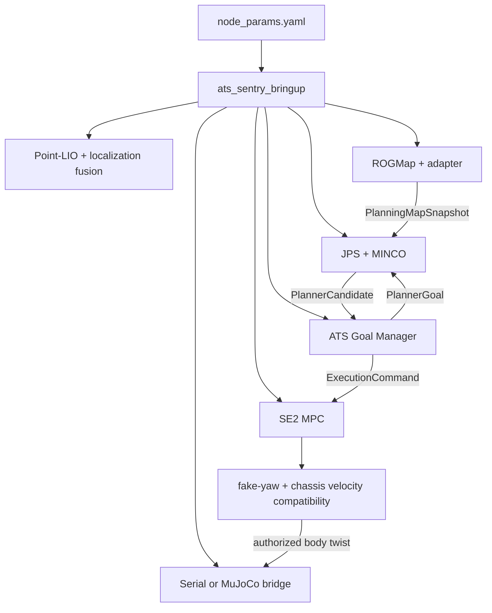

# Nav2 移除与导航架构重构计划

## 1. 目标与 Definition of Done

目标是让 ATS 自研导航链成为工作区内唯一活动导航实现，而不是继续维护 `launch_nav2:=false` 的旁路模式。

最终 DoD：

1. 实机、MuJoCo、loopback 和行为决策入口均只调用 `/ats_navigate_to_pose` 或 `/goal_pose`，不调用 `nav2_msgs` action。
2. 活动 ROS graph 无 `bt_navigator`、`planner_server`、`controller_server`、`behavior_server`、Nav2 lifecycle manager 和 `/plan`。
3. 活动 package manifest、CMake、launch、YAML、RViz 和测试中无 `navigation2`、`nav2_*` 构建/运行依赖。
4. `ats_nav2_plugins` 不再作为活动包；有价值的非 Nav2 算法必须先迁入中立 owner 并有测试。
5. `node_params.yaml` 是正式实机 profile 的唯一参数权威；不再通过 package 私有 YAML 覆盖同名节点参数。
6. planning grid、目标、候选轨迹、执行授权和底盘命令均有唯一 owner，stale/unknown/unreachable/unsafe/MPC failure 均确定性归零。
7. 默认矩形、红框、自研 action cancel/preempt/timeout、故障注入和实车前静态/HIL 门禁全部通过。
8. 实机 fake/chassis velocity compatibility 默认开启并与 Nav2 完全解耦；固定雷达 profile 才能显式关闭，且兼容 TF 与车体系速度契约完整。

本计划不保留仓库内 Nav2 对照 profile。对照能力由删除前基线 commit、版本标签、测试日志和必要的 rosbag 保存，不再让两套运行实现共享活动目录和参数。

## 2. 当前与目标运行图

### 2.1 当前过渡结构

```mermaid
flowchart TD
  B[bringup.launch.py] --> N{launch_nav2}
  N -->|true| N2[Nav2 servers + plugins + /plan]
  N -->|false| ATS[Goal Manager + MINCO + MPC]
  C[node_params.yaml] --> B
  C2[reality/simulation nav2_params.yaml] --> N2
  C3[minco/goal/mpc/rog private YAML] --> ATS
  N2 --> T[velocity transforms]
  ATS --> V[/cmd_vel]
  T --> V
```

双栈问题并不只在启动开关，而是贯穿依赖、参数、行为树、RViz、仿真脚本和 README。只把 `launch_nav2` 默认值改成 false 不能完成移除。

### 2.2 目标结构



## 3. 删除、迁移与保留清单

### 3.1 根仓 `src/ats_sentry_bringup`

| 对象 | 动作 | 前置条件 |
| --- | --- | --- |
| `launch/bringup.launch.py` | 移除 `nav2_common.RewrittenYaml`、`launch_nav2` 分支和 Nav2 topic 命名；直接加载总 YAML | 总 YAML 已通过 launch syntax/show-args |
| `launch/real_robot_nav2_free.launch.py` | 功能并入正式入口后改名或删除包装层 | 默认 `bringup.launch.py` 已唯一自研 |
| `launch/loopback_navigation.launch.py` | 重写为 ATS action + Goal Manager + MINCO + MPC | loopback 能提供 planning grid/localization |
| `launch/loopback_nav_only.launch.py` | 删除 Nav2 map/server/bringup，替换为自研最小链 | 静态 `/map` publisher 已验证 |
| `launch/loopback_decision_sim.launch.py` | 删除 Nav2 server 与 `nav2_loopback_sim` action 依赖 | 行为树只使用 `SendAtsNavGoal` |
| `params/node_params.yaml` | 原路径保留，删除所有 Nav2 段并合入自研节点参数 | 见统一配置方案 |
| `rviz/sentry_default_view.rviz` | 删除 costmap/MPPI/Nav2 GoalTool，增加 ROGMap/MINCO/MPC/health | 见 RViz 方案 |
| `package.xml` | 删除 Nav2 exec depends | launch 已无 Nav2 import |

### 3.2 导航仓 `src/ats_sentry_nav`

| 对象 | 动作 | 说明 |
| --- | --- | --- |
| `ats_nav_bringup` | 保留定位、传感器、静态图和自研导航编排；删除 Nav2 server/composition/lifecycle 分支 | 包名可暂保留，避免无收益的大规模 rename |
| `ats_nav_bringup/config/*/nav2_params.yaml` | 迁移非 Nav2 参数到总 YAML 后删除 | 禁止作为第二权威保留 |
| `ats_nav_bringup/rviz/nav2_*.rviz` | 删除或移出活动安装 | 新主 RViz 通过后执行 |
| `ats_nav2_plugins` | 物理删除活动包 | 用户已授权去除 Nav2；先确认没有非 Nav2 consumer |
| `trajectory_optimizer` | 拆分 | MINCO 仍依赖 RC traversability ESDF provider，不能整包删除 |
| `trajectory_optimizer/src/nav2/*`、Nav2 smoother/BT plugin | 删除 | 先把公共 ESDF provider 迁至 `minco_planner` 或独立中立库 |
| `fake_vel_transform`、`sentry_chassis_vel_transform` | 从 `launch_nav2` 条件中解耦，正式实机默认都启用；中间 topic 去 Nav2 命名 | 固定雷达 profile 才可显式关闭，且必须保持速度 frame 契约 |
| `ats_goal_manager`、`minco_planner`、`ats_swerve_mpc` | 保留并加固 | 是目标主链 owner |
| `ats_navigation_interfaces` | 扩展结构化 snapshot/candidate/incarnation | schema 仍由 `.msg/.action` 唯一权威 |
| `ats_rog_map`、`ats_rog_map_adapter` | 保留 | 禁止从可视化点云反解析数值 ESDF |

### 3.3 行为仓 `src/ats_sentry_behavior`

| 对象 | 动作 |
| --- | --- |
| `send_nav2_goal.*`、`pub_nav2_goal.*` | 删除 plugin build、注册和源码 |
| `send_nav_through_poses.*` 及 Nav2 test | 自研多航点 action 未完成前先用行为层逐点调用 ATS action；随后删除 Nav2 类型 |
| `package.xml` | 删除 `nav2_util`、`nav2_msgs` |
| `CMakeLists.txt` | 删除 Nav2 plugin 和测试 target |
| 参数/XML | 删除 `nav2_action_server`、`nav2_to_pose_action_server`，只保留 `ats_action_server` |

### 3.4 仿真仓

| 仓库/对象 | 动作 |
| --- | --- |
| `ats_mujoco_sim/twist_to_motion_ctrl.py` | 去掉“Nav2 Twist”命名；接收 MPC 唯一命令，clamp 与 MPC/总 YAML 同源 |
| MuJoCo launch | 删除 `launch_nav2` 兼容分支，固定自研 action |
| `loopback_sim` | 将 `nav2_loopback_sim` 包名与 Nav2 action server 迁移为 ATS loopback simulator |
| loopback params | 删除 `nav2_params.yaml`，改为总 YAML 的仿真 profile 或最窄 override |

## 4. 必须先解耦的隐含依赖

### 4.1 RC-ESDF provider

`minco_planner` 当前直接 include `trajectory_optimizer/esdf/rc_traversability_esdf_provider.hpp`。因此删除 `trajectory_optimizer` 前必须：

1. 将 RC-ESDF signed distance、unknown、梯度、插值语义迁入 `minco_planner` 或中立 `ats_rc_esdf` library；
2. 保留原测试，并新增 identical-input identical-output 回归；
3. 删除对 `nav2_costmap_2d`、Nav2 smoother/BT 的传递依赖；
4. 重新核对 JPS clearance、MINCO clearance、footprint gate、repair 是否使用同一 immutable snapshot。

### 4.2 静态图服务

Nav2-free 定位入口已有 `static_map_publisher.py`，可替代 `nav2_map_server`。正式删除前必须验证：

- `/map` 使用 reliable + transient local，late joiner 能收到；
- YAML origin 的 `x/y/yaw` 完整保留；
- image negate/occupied/free thresholds 与当前地图一致；
- 细栅格融合到 planning grid 时按面积重叠保守聚合，不做中心点采样。

### 4.3 RViz 目标入口

短期使用 RViz 默认 `SetGoal` 发布 `/goal_pose`，由 Goal Manager 统一接管并转为内部 action goal；长期再实现 `ats_rviz_plugins/NavigateToPoseTool`，显示 accept/result/cancel。删除 `nav2_rviz_plugins/GoalTool` 不得导致用户绕过 Goal Manager 直发 planner goal。

## 5. 分阶段实施

### N0：冻结 Nav2 对照基线

文件不修改。保存：

- 三个核心仓库 branch、HEAD、origin/develop；
- Nav2 默认矩形和红框日志；
- ROS graph、topic ownership、终点误差与故障注入结果；
- 当前 Nav2 参数和 RViz 截图。

Codex 不执行 git 写操作；基线 commit/tag、后续提交和 push 交给 Claude 按分仓执行。

### N1：让正式入口不再包含 Nav2 条件分支

修改 bringup 和 navigation launch，使正式入口直接启动自研链。速度兼容层不再由 `launch_nav2` 决定，而由各自参数独立控制，实机默认保持两者为 true。暂不删除 package，以便小步验证。

DoD：

- `ros2 launch ats_sentry_bringup bringup.launch.py --show-args` 无 `launch_nav2`；
- graph 无 Nav2 server、`/plan`；
- `/ats_navigate_to_pose` 唯一 action server；
- `/rc_esdf/planning_grid`、`/cmd_vel`、`/motion_control` owner 唯一。
- fake-yaw 关闭时 `gimbal_yaw_odom -> gimbal_yaw_fake` 零旋转兼容 TF 存在，且 `base_footprint -> base_link` 无重复 publisher。

### N2：行为、loopback 和 MuJoCo 切换

所有测试入口改为 ATS action。先让行为决策、最小 loopback、自研 MuJoCo 默认/红框通过，再删除旧 action plugin。

DoD：cancel、preempt、timeout、goal reject、server restart 和重复 tick 均有确定性结果；无 preempt storm，旧 result 不修改新任务。

### N3：解耦公共算法并删除 Nav2 构建依赖

迁移 RC-ESDF provider，删除 `ats_nav2_plugins`、Nav2 CMake/package dependencies、Nav2-only launch/RViz/config。

DoD：

```bash
rg -n 'navigation2|nav2_|nav2_msgs|nav2_common|nav2_core|nav2_costmap' \
  src/ats_sentry_bringup src/ats_sentry_behavior src/ats_sentry_nav \
  src/sim/ats_mujoco_sim src/sim/loopback_sim
```

结果只允许出现在历史迁移说明或明确的第三方目录，不得出现在活动 manifest、launch、源码、参数和测试。

### N4：物理清理与文档收口

删除旧包/资源，更新 `dependencies.repos`、README、docs、构建脚本和 CI。此阶段前禁止声称仓库级 Nav2-free。

## 6. 接口替换表

| Nav2 契约 | ATS 替代契约 | owner |
| --- | --- | --- |
| `nav2_msgs/NavigateToPose` | `ats_navigation_interfaces/NavigateToPose` | `ats_goal_manager` |
| `nav2_msgs/NavigateThroughPoses` | 行为层逐点 ATS action；后续可新增 ATS through-poses action | behavior/goal manager |
| `/plan` | `PlannerGoal -> JPS/MINCO`，debug 为 `/minco/raw_path` | `minco_planner` |
| global/local costmap | `/rc_esdf/planning_grid` + signed distance/clearance snapshot | ROGMap adapter |
| controller server | `ExecutionCommand -> ats_swerve_mpc -> velocity compatibility` | Goal Manager/MPC/transform owner |
| Nav2 behavior server | Goal Manager fail-stop + Local Collision Repair + 行为树策略 | 各行为 owner |
| lifecycle manager | heartbeat/lease + process supervision | bringup + 节点健康状态 |
| map server | `static_map_publisher.py` | `ats_nav_bringup` |
| Nav2 GoalTool | `/goal_pose` 或 ATS RViz action tool | Goal Manager |

## 7. 验证命令

每个源码阶段至少执行：

```bash
MAKEFLAGS=-j1 colcon build --base-paths src --packages-select \
  ats_navigation_interfaces ats_rog_map_interfaces ats_rog_map ats_rog_map_adapter \
  minco_planner ats_goal_manager ats_swerve_mpc ats_nav_bringup \
  ats_sentry_bringup ats_sentry_behavior --parallel-workers 1

colcon test --base-paths src --packages-select \
  ats_rog_map ats_rog_map_adapter minco_planner ats_goal_manager ats_swerve_mpc \
  ats_sentry_behavior

python3 -m py_compile <本阶段修改的 launch 文件>
ros2 launch ats_sentry_bringup bringup.launch.py --show-args
```

运行门禁使用全新 `ROS_DOMAIN_ID` 和全新 MuJoCo 进程：

```bash
PLANNING_GRID_OWNER=rog_map P2_FAULT_CASE=none \
  TEST_PROFILE=default GOAL_TIMEOUT=180 scripts/test_mujoco_minco_mpc_chain.sh

PLANNING_GRID_OWNER=rog_map P2_FAULT_CASE=none \
  TEST_PROFILE=red_box GOAL_TIMEOUT=180 scripts/test_mujoco_minco_mpc_chain.sh
```

脚本必须固定 `NAVIGATION_MODE=ats` 或等价自研入口，并明确拒绝 `/plan` 与 Nav2 server。旧的 Nav2 `NavigateToPose` 基线不能作为本计划验收结果。

## 8. 停止条件与回滚点

满足任一条件立即停止继续删除：

- 尚未迁移的非 Nav2 consumer 仍链接 `trajectory_optimizer` 或 `ats_nav2_plugins` 中待删符号；
- `/map` late joiner、origin yaw 或 occupied 保守聚合回归失败；
- 自研 action 的 cancel/preempt/result 不确定；
- Nav2 移除时速度兼容层被隐式关闭、下游不再收到车体系速度或 TF owner 重复；
- stale/unknown/unreachable/unsafe/MPC failure 任一注入出现非零 `/cmd_vel` 或 `/motion_control`；
- 用户现有修改与目标文件重叠且无法安全合并。

每阶段以阶段开始前的分仓 HEAD 为回滚点。禁止 `git reset --hard` 或 force push。
