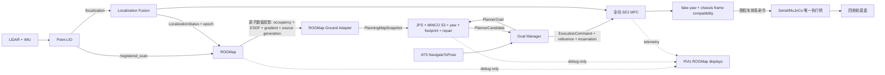

# 项目优化总览与问题评分

## 1. 审查结论

截至 2026-07-31，ATS 已经具备自研 `NavigateToPose`、Goal Manager、JPS、MINCO S3、footprint gate、Local Collision Repair、结构化 `ExecutionCommand` 和全向 SE2 MPC 的主体骨架，但仍处于“自研链与 Nav2 对照链共存、参数多权威、关键版本关联未原子化”的过渡状态。

当前不能把“存在 `real_robot_nav2_free.launch.py`”等同于“仓库已移除 Nav2”。活动源码中仍有：

- `ats_sentry_bringup/bringup.launch.py` 和 `ats_nav_bringup` 对 `nav2_common` 的直接导入；
- `navigation_launch.py` 中完整 Nav2 server、lifecycle 与 composable 分支；
- `node_params.yaml`、reality/simulation `nav2_params.yaml` 中的 Nav2 参数段；
- `ats_sentry_behavior` 中 `nav2_msgs` action 节点和构建依赖；
- `ats_nav2_plugins` 包、Nav2-only loopback launch、Nav2 RViz 资产；
- 主 RViz 中的 `plan`、global/local costmap、MPPI 和 `nav2_rviz_plugins/GoalTool`。

因此本次重构的目标不是再新增一套 Nav2-free 旁路，而是让自研链成为唯一活动权威，并从运行期、launch、参数、构建依赖、测试和文档中依次移除 Nav2。

## 2. 评分模型

每项风险满分 100：

$$
R = S_{30} + C_{25} + H_{20} + B_{15} + T_{10}
$$

- $S$：运动安全影响，满分 30；
- $C$：接口/状态正确性，满分 25；
- $H$：实车准入阻塞，满分 20；
- $B$：影响范围，满分 15；
- $T$：测试缺口，满分 10。

| 等级 | 分数 | 处理规则 |
| --- | ---: | --- |
| S0 | 90-100 | 阻塞通电运动或任何实车声明 |
| S1 | 75-89 | 阻塞架构收敛或主链发布 |
| S2 | 55-74 | 影响功能、性能或可维护性，进入阶段内必做 |
| S3 | 30-54 | 工程治理、诊断和文档整改 |
| 建议 | 0-29 | 不阻塞当前主线，按收益安排 |

## 3. 风险评分

下表中的“确认”指源码静态确认，不代表故障已在 MuJoCo 或实车复现。

| ID | 问题 | 分解 `S/C/H/B/T` | 总分 | 等级 | 证据状态 |
| --- | --- | --- | ---: | --- | --- |
| R01 | MPC 定位跳变只封锁一个控制周期，下一帧即可恢复旧执行授权 | `30/24/20/10/9` | 93 | S0 | `已验证-静态` |
| R02 | MID360 外参、轮径/减速比、舵角零位、执行器上限尚未完成目标机标定 | `30/20/20/12/10` | 92 | S0 | `未验证-实车` |
| R03 | adapter 的 planning grid、generation 和 `PlanningMapStatus` 分 topic 发布，grid 本身不携带 publication/source generation | `28/25/18/12/9` | 92 | S0 | `已验证-静态` |
| R04 | MINCO runtime safety 使用候选 reference 时间轴，Goal Manager 提交时再次重定时，监控进度可能与正式执行进度不一致 | `29/24/18/11/9` | 91 | S0 | `已验证-静态` |
| R05 | Goal Manager 的 `goal_id`、`command_sequence`、yaw request sequence 仅进程内单调，缺少 restart incarnation | `27/25/18/11/9` | 90 | S0 | `已验证-静态` |
| R21 | 实机规范要求 fake/chassis 速度兼容层默认开启，但 Nav2-free 包装层钉死为 false，内层又把两者错误绑定到 `launch_nav2` | `27/24/18/12/8` | 89 | S1 | `已验证-静态` |
| R06 | 串口同时接收裸 `/cmd_vel` 和独立 `ExecutionCommand`；虽有授权门，速度样本与授权样本仍不是同一 DDS 原子样本 | `27/23/18/12/8` | 88 | S1 | `已验证-静态` |
| R07 | 主仓仍保留完整 Nav2 运行/构建/配置双栈，默认入口和对照入口的权威边界容易漂移 | `20/24/19/15/9` | 87 | S1 | `已验证-静态` |
| R08 | ROGMap、adapter、MINCO、Goal Manager、MPC 和串口参数分散在多个 YAML，launch 仍进行 profile 覆盖 | `20/25/18/15/8` | 86 | S1 | `已验证-静态` |
| R09 | 云台桥查询最新 TF 并以当前时刻发布状态，未显式校验 TF 样本时间年龄 | `27/22/18/10/8` | 85 | S1 | `已验证-静态` |
| R10 | MPC heartbeat 的 `same_reference` 只比较 identity/generation/reference stamp，不校验 frame、yaw、poses 或 digest | `25/24/16/10/8` | 83 | S1 | `已验证-静态` |
| R11 | MINCO 已定义 `InitialKinematicState`，节点却没有 `/localization` 订阅，也未向四处 `optimize()` 传入实车首端状态 | `22/23/18/11/8` | 82 | S1 | `已实现未接线` |
| R12 | `ReferenceTrajectory` 的 `vx/vy/ax/ay` 在转换为 `nav_msgs/Path` 时丢失，MPC 依靠路径时间戳/差分恢复前馈 | `18/22/15/13/8` | 76 | S1 | `已验证-静态` |
| R13 | ROGMap 实机 map config、adapter config、bringup 总参数存在多处权威；最终生效值依赖 launch 路径 | `15/23/17/13/7` | 75 | S1 | `已验证-静态` |
| R14 | Local Collision Repair 默认关闭，无周期重规划；runtime unsafe 当前只能停机 | `21/19/14/11/8` | 73 | S2 | `已验证-静态` |
| R15 | MINCO 没有优化器内安全走廊约束，主要依赖 ESDF 启发式修正与事后 swept footprint gate | `20/19/14/10/8` | 71 | S2 | `已验证-静态` |
| R16 | `/rog_map/esdf` 是可视化 `PointCloud2`；source generation、数值 ESDF 与 planning grid 仍未封装为同一不可变消息 | `18/23/12/10/7` | 70 | S2 | `已验证-静态` |
| R17 | 主 RViz 仍以 Nav2 costmap/MPPI/GoalTool 为主，缺 ROGMap 点云组、边界 Marker 和自研 action 工具 | `7/16/10/14/7` | 54 | S3 | `已验证-静态` |
| R18 | 根 README、导航 README 和多份 docs 仍把 Nav2 写成默认主链 | `4/15/8/15/8` | 50 | S3 | `已验证-静态` |
| R19 | ROGMap 原项目风格的 local/visualization/update/search range 彩色框未在 ATS 节点发布 | `3/13/5/12/6` | 39 | S3 | `未实现` |
| R20 | 参考文章中的约 50 Hz、约 6 ms 与内存结论未在 ATS 目标机复现 | `2/12/5/8/10` | 37 | S3 | `未验证-性能` |

### 3.1 关键源码锚点

- R01：`ats_swerve_mpc/src/ats_swerve_mpc_node.cpp` 的 `odometryUsable()` 明确在跳变后清除标志并只拒绝一个周期。
- R03：`ats_rog_map_adapter_node.cpp` 依次发布 planning grid、两个距离 grid、generation，再发布 status；`OccupancyGrid` 无 publication 字段。
- R04：`minco_planner_node.cpp::publishReferenceIfCurrent()` 重定时候选并保存 `active_safety_reference_`；`ats_goal_manager_node.cpp` 提交时再次重定时。
- R05：`ExecutionCommand.msg` 注释说明 sequence 是“per Goal Manager process”；Goal Manager 的计数器都从 0 初始化。
- R06：`standard_robot_pp_ros2.cpp` 分别订阅 `/cmd_vel` 与 `/planner/execution_command`，由本地 gate 合取。
- R21：根 bringup 声明两个兼容层默认 true，但 `real_robot_nav2_free.launch.py` 传 false；`navigation_launch.py` 又以 `launch_nav2==true` 作为启用条件。
- R09：`gimbal_yaw_status_bridge.cpp::jointStateCallback()` 调用最新 TF 查询，`publishStatus()` 使用 `now()` 作为 header stamp。
- R10：`ats_swerve_mpc_node.cpp::onExecutionCommand()` 的 `same_reference` 仅比较 goal/epoch/generation/publication/stamp。
- R11/R12：`minco_planner_node.hpp` 无 odometry subscription；`toPath()` 只写 position、orientation 和时间戳。

## 4. 当前接口连通度

| 链路 | 当前状态 | 结论 |
| --- | --- | --- |
| Point-LIO `/localization`、`/registered_scan` -> ROGMap | 已接 | 保留，不把 ROGMap改成定位器 |
| ROGMap 数值 service -> adapter | 已接 | adapter 未订阅 `/rog_map/esdf`，方向正确 |
| adapter -> planning grid/status/generation | 已接但非原子 | R03，需结构化 snapshot |
| planning grid -> JPS/MINCO/footprint/repair | 已接 | 单次 MINCO 本地 snapshot 可证明一致 |
| ATS action -> Goal Manager -> PlannerGoal | 已接 | 缺 process incarnation |
| MINCO candidate Path + PlannerStatus -> Goal Manager | 已接但非原子 | 应合并为 `PlannerCandidate` |
| Goal Manager -> MPC `ExecutionCommand` | 已接且消息内原子 | 仍需 incarnation、reference digest/完整性校验 |
| MPC -> fake/chassis compatibility -> 串口 `/cmd_vel` + authorization | 规范与当前 Nav2-free 接线冲突 | 兼容层与 Nav2 解耦，默认开启；固定雷达 profile 才显式关闭 |
| MPC -> MuJoCo `/motion_control` | 通过 Twist bridge | bridge 仍使用旧 Nav2 命名和独立 clamp，需收敛 |
| MINCO 解析前馈 -> MPC | 未接 | `Path` 无 `vx/vy/ax/ay` |
| MINCO 首端状态 <- localization twist | 未接 | optimizer API 已有、节点 wiring 缺失 |
| ROGMap bounds/update/search -> RViz Marker | 未接 | 仅有四类点云 |
| 自研 action -> RViz 目标工具 | 未接 | 当前仍是 `nav2_rviz_plugins/GoalTool` |

## 5. 目标架构

## 6. 优化优先级

1. 先修版本、授权与 frame 契约：R01、R03、R04、R05、R06、R09、R10、R21。
2. 再完成 Nav2 唯一化和单 YAML：R07、R08、R13。
3. 接通规划控制数值语义：R11、R12、R14、R15、R16。
4. 最后重建 RViz、README 和文档：R17-R20。

任何阶段只要出现以下情形即停止扩大修改范围：planning grid 出现多 publisher、`/cmd_vel` 或 `/motion_control` 出现多 owner、Nav2-free graph 仍出现 Nav2 server、地图/定位 stale 后仍有非零速度、或新的 YAML 与旧 YAML 同时对同一正式 profile 生效。
